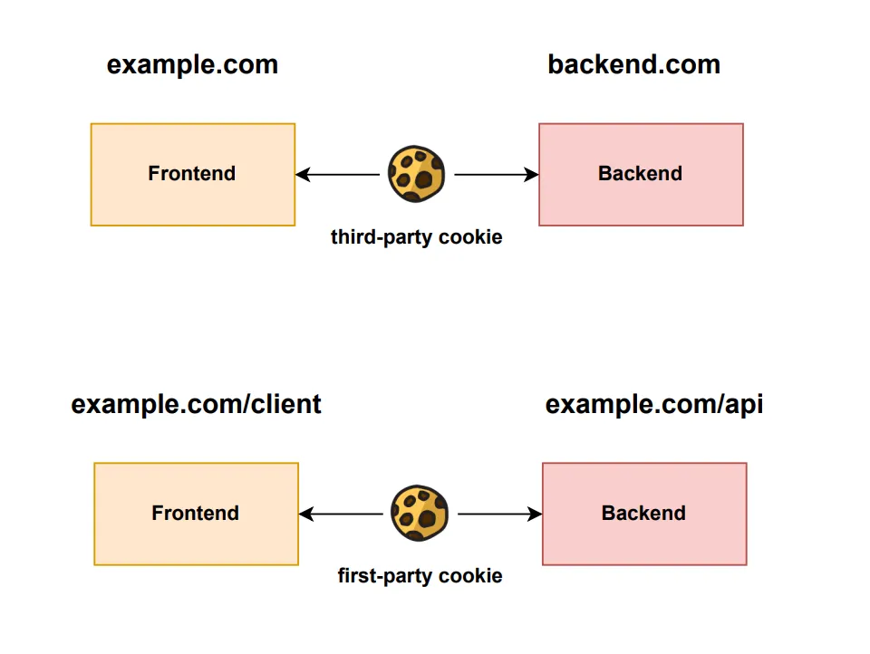
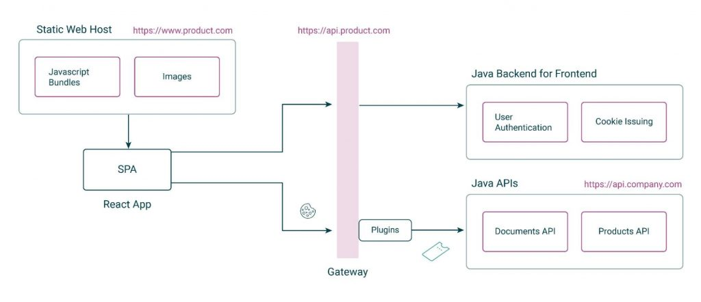
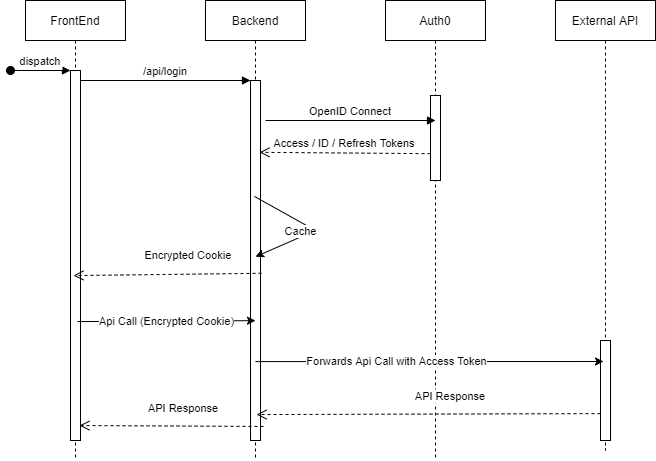
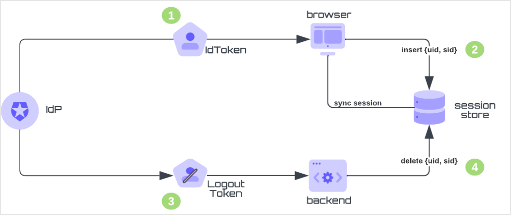
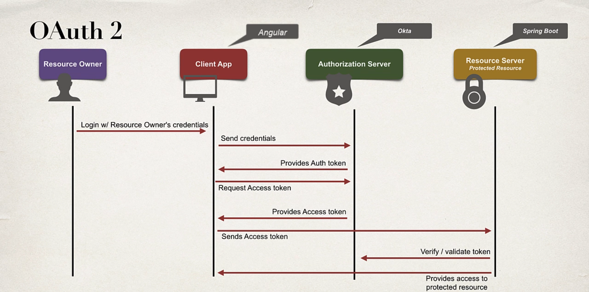

# OAuth2WithKeycloak
implementing OpenID Connect for SPAs in Javascript (React, Angular, Vue...)is no longer recommended for the following reasons:
1. Using access tokens in the browser has more security risks than using secure cookies.
2. A SPA is a public client and cannot keep a secret, as such a secret would be part of the JavaScript and could be accessible to anyone inspecting the source code.
3. Recent browser changes to prevent tracking may result in 'third-party cookies' being dropped.
4. It is not possible to store something securely in the browser for a long period of time, as it can be stolen by various attacks.

// This are different origins since subdomain are different
1. https://developer.mozilla.org
2. https://mozilla.org

// This are also different origins since port number is different
1. https://localhost:5001
2. https://localhost:7001

A domain name typically has two parts: The top-level domain (TLD) is the extension, such as .com or .org, and the second-level domain (SLD) is the unique part of the domain name, often a business or brand name. In the hubspot.com example, com is the TLD and hubspot is the SLD.The subdomain is what goes before the SLD. The most common subdomain is www.

The backend for frontend pattern for authentication helps mitigate a risk associated with negotiating and handling access tokens from public clients.This pattern makes use of OpenIDConnect to request and receive identity information about authenticated users.BFFs are often used in banking and healthcare scenarios

This means that the spa frontend application must be deployed on the same domain(on the domain) and the backend api(on a subdomain). For instance  `www.example.com` for the SPA, and `api.example.com` for the backend.This enables cookies issued to be first party and prevents them being dropped by browsers. The cookies should also use the SameSite=strict parameter, to maintain a high level of security.This makes the cookie secure and also not shared across different domains, hence why the frontend and the backend need to be on the same top-level domain; request can still be same-site even if it's issued cross-origin
This hides the complexity of authorization flows from the SPA. A simple API can be exposed to the SPA, and the SPA does not need to be aware of the security details. 



## with BFF we can:
1. statefull - stores tokens in memory and uses a session to manage them(redis).
2. stateless - stores the tokens in encrypted HTTP-only, same-page cookies.
### There are two main ways to map the token to the cookie:
1. Keep a map of cookie -> token relations( redis)
  In this case, the cookie can be an opaque string.
2. Encrypting the token and returning it as a cookie






## Back Channel logout
In back-channel logout, logout tokens sent directly to your application contain claims to determine which session to end. To use back-channel logout, your application must be able to store and track the session information, including the session ID (sid) claim 
obtained during user authentication so that its local session can be terminated later during back-channel logout flow via a logout token.

Back-channel communications between applications and identity providers (IdP) use the publish–subscribe pattern.Applications register HTTP(s) webhooks to receive logout tokens when the identity provider requests session logout.Back-channel communications do not involve the end-user’s browser, but use a backend to receive and synchronize the application’s session status.
  
Applications cannot rely on session cookies to determine which session to terminate when communications are performed via the back-channel. Rather, the service depends on a shared session identifier (sid) claim on ID and logout tokens.

When end-users successfully authenticate with Auth0 during login, the authorization server assigns an access, ID, and logout token. The ID and logout token contain the claims you need in the back-channel logout workflow.


             
## The "__Host-" Prefix
If a cookie's name begins with a case-sensitive match for the string __Host-, then the cookie will have been set with a Secure attribute, a Path attribute with a value of /, and no Domain attribute.
The __Host- prefix expects cookies to fulfill the following conditions:

1. The cookie must be set with the Secure attribute.
2. The cookie must be set from a URI considered secure by the user agent.
3. Sent only to the host who set the cookie and MUST NOT include any Domain attribute.
4. The cookie must be set with the Pathattribute with a value of / so it would be sent to every request to the host.

This combination yields a cookie that hews as closely as a cookie can to treating the origin as a security boundary. The lack of a Domain attribute ensures that the cookie's host-only-flag is true, locking the cookie to a particular host, rather than allowing it to span subdomains. Setting the Path to / means that the cookie is effective for the entire host, and won't be overridden for specific paths. The Secure attribute ensures that the cookie is unaltered by non-secure origins, and won't span protocols.
 If cookie has __Host- prefix e.g. Set-Cookie: __Host-token=RANDOM; path=/; Secure then the cookie:

1. Cannot be (over)written from another subdomain.
2. Must have the path of /.
3. Must be marked as Secure (i.e, cannot be sent over unencrypted HTTP).

Ports are the only piece of the origin model that __Host- cookies continue to ignore.

For example, the following cookies would always be rejected:

Set-Cookie: __Host-SID=12345
Set-Cookie: __Host-SID=12345; Secure
Set-Cookie: __Host-SID=12345; Domain=site.example
Set-Cookie: __Host-SID=12345; Domain=site.example; Path=/
Set-Cookie: __Host-SID=12345; Secure; Domain=site.example; Path=/
While the following would be accepted if set from a secure origin (e.g. "https://site.example/"), and rejected otherwise:

Set-Cookie: __Host-SID=12345; Secure; Path=/

CNAME records map a domain name to another (canonical) domain name

1. [Auth0](https://auth0.com/docs/authenticate/login/logout/back-channel-logout)
2. [cloudentity](https://cloudentity.com/developers/blog/adding-oauth-proxy-bff-component-to-spa/)
3. [SameSite Restrictions](https://portswigger.net/web-security/csrf/bypassing-samesite-restrictions)


4. [DNS CName Record](https://www.cloudflare.com/learning/dns/dns-records/dns-cname-record/)

5. [DNS A Record](https://www.cloudflare.com/learning/dns/dns-records/dns-a-record/)
 
6. [DNS Server](https://www.cloudflare.com/learning/dns/dns-server-types/#authoritative-nameserver)

7. [Keystore and Trustsore](https://www.baeldung.com/java-keystore-truststore-difference)

8. [OAuth](https://www.shuttle.rs/blog/2023/08/30/using-oauth-with-axum)

## Certificate
``keytool -genkeypair -alias senderKeyPair -keyalg RSA -keysize 2048 
  -dname "CN=Baeldung" -validity 365 -storetype JKS 
  -keystore sender_keystore.jks -storepass changeit``

This creates a private key and its corresponding public key for us. The public key is wrapped into an X.509 self-signed certificate which is wrapped in turn into a single-element certificate chain. We store the certificate chain and the private key in the Keystore file sender_keystore.jks, which we can process using the KeyStore API.

  ```bash
  keytool -genkey -alias serverkey -keyalg RSA -keysize 2048 -sigalg SHA256withRSA -keystore serverkeystore.p12 -storepass password -ext san=ip:127.0.0.1,dns:localhost -validity 3650 -keypass password
  ```

A SAN or subject alternative name is a structured way to indicate all of the domain names and IP addresses that are secured by the certificate.Originally, SSL certificates only allowed the designation of a single host name in the certificate subject called Common Name.The common name represents the host name that’s covered by the SSL certificate. The most common example is a single certificate covering both the root domain and the www subdomain. In fact, it’s common to reuse the same SSL certificate for example.com and www.example.com.
We use the keytool -ext option to set the Subject Alternative Names (SAN) to define the local hostname/IP address that identifies the server
Next, we export the certificate to the file server-certificate.pem:

```bash
keytool -exportcert -keystore serverkeystore.p12 -alias serverkey -storepass password -rfc -file server-certificate.pem
```
When using a self-signed certificate, we need only to export it from the Keystore file. We can do this with the exportcert command:

```bash
keytool -exportcert -alias senderKeyPair -storetype JKS 
  -keystore sender_keystore.jks -file 
  sender_certificate.cer -rfc -storepass changeit
  ```

  Public certificate can have the following common file extensions:

1. “.crt” extension: Certificate may be encoded as binary DER Or ASCII PEM.
2. “.der” extension: Certificate encoded with binary DER.
3. “.pem” extension: Certificate encoded with ASCII (Base64).

## Back-Channel logout
A back-channel logout takes place between Keycloak and its clients. Keycloak detects a user's logout and sends a request containing a logout token to all clients where the user is logged in.

Back-channel logout operates as follows:

1. The user presses the logout button in Application 01.
2. Application 01 clears out the user's session while informing Keycloak that the user is logging out.
3. Keycloak invokes Application 02's logout endpoint, asking it to remove the user's session.


TrustStore are used by clients to trust the certificate authority by adding the CA certificate into the truststore
The KeyStore is used by the server to store mulitple things. For encrypting communication between the client and the server, we need to set up a tls connection, which requires a private and public key

Certifiate authority that contins a private key and a public certificate
 Use keytool to create truststore

 A keystore when generated has a keypair inside of it( eg RSA)
 The keystore also needs to contain the application certificate

 Using a cryptographic algorithm, the keys are mathematically connected in such a way that you can derive the public key from the private key, but you cannot take the public key and get its paired private key.


 ### Generate Certificate Signing Request
 - `openssl genrsa -out ca.key 2048` Generate a private key
 - `openssl req -new -key ca.key -out ca.csr`  Generate a CSR
 - `openssl req -new -newkey rsa:2048 -keyout ca.key -out ca.csr` Generate a private key and a CSR

 When creating the CSR, `openssl` uses the private key to extract the public key and put it in the CSR
 We can use this command `openssl req -in ca.csr -text -noout` to decode the request(CSR)
 Use this `openssl req -new -x509 -keyout ca.key -out ca.cert -days $3650` to create a self signed certificate and private key
 We can use this command `openssl x509 -in ca.cert -text -0nout` to decode the certificate
 
A quick look at the output shows that the issuer and subject are the same,meaning it is self-signed
We can also see that the Subject Key Identifier and the Authority Key Identifer are the same
We can also see that CA property is true, which means this is a CA

`openssl genrsa -aes256 -out ca.key 4096` uses aes256 to encrypt the private key( good for CAs)

We can also use the CA private key to generate a CA certificate
`openssl req -key ca.key -new -x509 -days 3650 -sha256 ca.cert`
The certificate signing request generated can be signed using the CA privake key as follows

`openssl ca -days 3650 -in ca.csr -out ca.cert extensions server_cert`

We can use `echo "127.0.0.2 www.example.com">> /etc/hosts`

IPv4 reserves all addresses in the range 127.0.0.0 up to 127.255.255.255 for use in loopback testing

 A network interface is the point of connection between a computer and a network. In other words, how the Linux system links up the software side of networking to the hardware side.

 `br0` is a linux bride( virtual bridge) or switch

 The second layer of the OSI model-The data link layer can be split into two sections
 - Logical Link Control(LLC)
 - Media Access Control(MAC)
The Logical link control establishes path for data on the Ethernet to transmit between devices
The Media Access Control uses hardware addresses that are assigned to network interface cards to identify a specific computer or device to show the source and destination of data transmissions

Ethernet transmits data packets in this data link layer by using an algorithm called CSMA/CD.
It is used as a standard for Ethernet to reduce data collisions and increase successful data transmission
The IP address assigned to `lo0` interface is 127.0.0.1

A network interface is a software interface to a networking hardware.

A network interface is how the kernel links up the software side of networking to the hardware side.

Linux kernel distinguishes between two types of network interfaces: physical and virtual.
There are different kinds of virtual interfaces e.g. Loopback, bridges, VLANs, tunnel interfaces
LOOPBACK — this interface does not communicate with other hosts. All packets sent through it will be returned


`openssl genrsa -aes-256-cbc -out myprivate.key` Specifying a cipher means one wants to encrypt( symmetric) the private key
The options for AES are aes-128-cbc,aes-128-ecb ,aes-192-cbc       aes-192-ecb,aes-256-cbc,aes-256-ecb

We can then use the private key to derive a public key
`openssl rsa -in myprivate.key -pubout > mypublic.key` then enter pass phrase for private key

## Docker
```bash
docker run -it eclipse-temurin:17 bash
apt-get update
apt-get -y install vim
```


### Starting a Shell in a Running Container
To start a shell process in a running container, we can use the command:
- Using -it, we can start up an interactive shell process that is listening to the STDIN
-  docker exec -it <container-name> /bin/sh

Using OIDC for authentication and OAuth2.0 for authorization help provides a complete protocol for securely determining who a client is ,what they are allowed to access and what actions they are allowed to perform

Okta,Auth 0 have their implementatons of these protocols

```bash
# Password used for all the certs, keys, and stores
PASS=test1234
# Broker server host
SERVER_HOST=localhost
# Client server host
CLIENT_HOST=localhost

# Create the root CA
openssl req -new -x509 -keyout ca-key -out ca-cert -days 365 \
-passout pass:$PASS -batch \
-subj "/C=US/ST=Oregon/L=Portlad/O=Okta/CN=CARoot"

# Import the root CA into server truststore
keytool -keystore server.truststore.jks -alias CARoot -import -file ca-cert -storepass $PASS -noprompt

# Import the root CA into the client truststore
keytool -keystore client.truststore.jks -alias CARoot -import -file ca-cert -storepass $PASS -noprompt

# Create the server keystore with a private key and unsigned certificate.
keytool -keystore server.keystore.jks -alias server \
-validity 365 -keyalg RSA -genkey -storepass $PASS -ext SAN=DNS:$SERVER_HOST \
-dname "CN=$SERVER_HOST,OU=Kafka-Spring,O=Okta,L=Portland,S=Oregon,C=US"

# Export server cert
keytool -keystore server.keystore.jks -alias server -certreq -file cert-file-server -storepass $PASS

# Sign the server cert with the root CA
openssl x509 -req -CA ca-cert -CAkey ca-key -in cert-file-server -out cert-signed-server -days 365 -CAcreateserial -passin pass:$PASS

# Import server cert and root CA into server keystore
keytool -keystore server.keystore.jks -alias CARoot -import -file ca-cert -storepass $PASS -noprompt
keytool -keystore server.keystore.jks -alias server -import -file cert-signed-server -storepass $PASS -noprompt

keytool -keystore client.keystore.jks -alias client \
-validity 365 -keyalg RSA -genkey -storepass $PASS -ext SAN=DNS:$CLIENT_HOST \
-dname "CN=$CLIENT_HOST,OU=Kafka-Spring,O=Okta,L=Portland,S=Oregon,C=US"

# Export client cert
keytool -keystore client.keystore.jks -alias client -certreq -file cert-file-client -storepass $PASS

# Sign the client cert
openssl x509 -req -CA ca-cert -CAkey ca-key -in cert-file-client -out cert-signed-client -days 365 -CAcreateserial -passin pass:$PASS

# Import client cert and CA into client keystore
keytool -keystore client.keystore.jks -alias CARoot -import -file ca-cert -storepass $PASS -noprompt
keytool -keystore client.keystore.jks -alias client -import -file cert-signed-client -storepass $PASS -noprompt
```

## Metrics
prometheus runs on port 9090

```bash 
 curl https://localhost:8097/metrics --cacert ./src/main/resources/ca-cert  
```


## RBAC
About managing access to resources
roles have permissions

Permissions are granted to roles which gives access to capability
then roles are assigned to users
groups are a better way

We can categorize Access Control Model into three types:

- Role-based Access Control (RBAC)
- Access Control Lists (ACL)
- Attribute-based Access Control (ABAC)

ACL is a good alternative

A role is a collection of actions that the assigned identity will be able to perform


A user has many roles and a role has many permissions
 ## MFA
uri=/Type(hotp or totp) / label?secret & issuer

 [Hotp vs totp](https://www.youtube.com/watch?v=XYVrnZK5MAU)
## Tech
- Scala 3 (for logic)
- Cats (for functional)
- FS2 (for streaming)
- Http4s (for rest etc)
- Doobie
- Postgres
- Redis( Redis4Cats)
- Tapir (for swagger) ?
- sbt (for build)


## What is an algebra?
An algebra is a collection of functions operating over some data types, along with a set of laws specifying relationships between these functions
What makes an API into an Algebra

- Boobean Algebra
- Relational Algebra


## 

 Different interfaces allow a device to connect with various other devices and systems. For example, a computer may have USB ports, HDMI ports, and Ethernet ports to connect to different types of peripherals and networks.

 Default Route: In the context of routing tables, 0.0.0.0 is often used as the default route. When a device has a route entry with the destination address 0.0.0.0, it indicates that any IP address that does not match a more specific route should use this default route. In other words, 0.0.0.0 is a wildcard or placeholder for any destination IP address not covered by more specific routes.

 Binding to All Available Network Interfaces: In certain network configurations, using 0.0.0.0 as the IP address can signify that a service or application should bind or listen on all available network interfaces on a device. For example, a server application configured to listen on 0.0.0.0 will accept incoming connections on all network interfaces, whether they are associated with a specific IP address or not.

 DHCP Client Request: In the context of DHCP (Dynamic Host Configuration Protocol), a client may use 0.0.0.0 as its source IP address when initially requesting an IP address assignment from a DHCP server. This is part of the DHCP discovery process where the client does not yet have a valid IP address.

Interfaces are networking communication points for your computer. Each interface is associated with a physical or virtual networking device.

Typically, your server will have one configurable network interface for each Ethernet or wireless internet card you have.

Many times, administrators configure one interface to service traffic to the internet and another interface for a LAN or private network.

In datacenters with private networking enabled (including DigitalOcean Droplets), your VPS will have two networking interfaces. The “eth0” interface will be configured to handle traffic from the internet, while the “eth1” interface will operate to communicate with a private network

When you create the socket and bind it to that address, the system uses the associated interface.


```java
/**
 * This class represents a Network Interface made up of a name,
 * and a list of IP addresses assigned to this interface.
 * It is used to identify the local interface on which a multicast group
 * is joined.
 *
 * Interfaces are normally known by names such as "le0".
 *
 * @since 1.4
 */
public final class NetworkInterface {
    private String name;
    private String displayName;
    private int index;
    private InetAddress addrs[];
    private InterfaceAddress bindings[];
    private NetworkInterface childs[];
    private NetworkInterface parent = null;
    private boolean virtual = false;
    private static final NetworkInterface defaultInterface;
    private static final int defaultIndex; /* index of defaultInterface */
}

```
For instance eth0:1 will be a subinterface to eth0.


A network interface having multiple IP addresses can serve various purposes, and there are several scenarios where this might be beneficial:

Virtual Hosting:

In a web hosting environment, a single physical server may host multiple websites. Each website can be associated with a unique IP address, allowing the server to distinguish between the different hosted domains. This is known as virtual hosting.
Network Segmentation:

Multiple IP addresses on a network interface can be used to segment a network. Different IP subnets may be assigned to different segments of a network, helping in organizing and managing network traffic effectively.
Load Balancing:

Multiple IP addresses can be associated with a server that is part of a load-balanced cluster. Load balancers distribute incoming traffic across multiple servers to ensure optimal resource utilization and prevent overloading a single server.
Failover and High Availability:

In a high-availability setup, a network interface with multiple IP addresses can be used to implement failover. If one server fails, traffic can be redirected to another server with a different IP address, ensuring continuous service availability.
Virtualization:
In virtualized environments, a physical server may host multiple virtual machines (VMs), each with its own IP address. This allows VMs to operate independently, as if they were running on separate physical machines.
IP Alias and Network Testing:

Multiple IP addresses can be assigned to a network interface for testing purposes or to simulate multiple network configurations. This can be useful for developers and network administrators during testing and troubleshooting.
Service Differentiation:

Different services on a server may be associated with different IP addresses. For example, a server may have one IP address for web services, another for email, and another for database services.
Security and Access Control:
Assigning different IP addresses to specific services or applications can help in implementing access control and security policies. Firewalls and access control lists (ACLs) can be configured based on IP addresses to control traffic.
IPv6 Transition:

During the transition from IPv4 to IPv6, a network interface may have both IPv4 and IPv6 addresses. This allows compatibility with both addressing schemes and facilitates a smoother transition to the newer protocol.
Network Address Translation (NAT):

In scenarios where Network Address Translation is employed, a network interface might have multiple IP addresses, including private addresses for internal communication and a public address for external communication. NAT translates between these addresses to allow internal devices to communicate with external networks.

Virtual network interfaces can be created on a computer for various purposes, such as virtualization or network tunneling.

a network interface is the point of interconnection between a device and any of its network connections
Of course, systems often have multiple active network connections, such as wired ethernet, WIFI, Bluetooth, etc.

subinterfaces (also known as virtual interfaces) attached to this network interface

A NetworkInterface object contains a name and a set of IP addresses assigned to it. So binding to any of these addresses will guarantee communication through this interface.


In the bridge mode, a virtual machine connects to the physical network directly through the host physical NIC. In this mode, the host's NIC is a bridge to all VMs

VMs obtain IP addressing information from a DHCP server on the physical network. A VM  appears to other nodes as just another computer on the network


The host computer can also act as a NAT device. In this mode, a virtual DHCP server is responsible for assigning IP addressing information to VMs, forming a private network. Other machines on the physical network are getting IP addressn information from the physical DHCP server


Bridge (docker0)

A container connects to this network when it starts running without specifying a network. Containers connected to the bridge network are given an internal IP address to communicate with each other


Host
A container shares the networking namespace of the host when using the host network mode. As a result, the host's IP address and port will be used by the container to isolate and execute the process directly on the host.


`docker network create -d macvlan --subnet=192.168.0.0/24 --gateway=192.168.0.1 -o parent=eth0 demo-macvlan`

he output below demonstrates that the new 'demo-macvlan' network is set up with the subnet '192.168.0.0/24' gateway '192.168.0.1' and parent interface 'eth0'. Specifying 'eth0' as the parent interface indicates that the Macvlan network will use the physical network interface eth0 of the Docker host to connect to the external network:

iptables is the standard Linux packet filtering tool. Rules added to iptables define how traffic is routed as it passes through your host’s network stack. Docker networks add filtering rules which direct matching traffic to your container’s application. The rules are automatically configured, so you don’t need to manually interact with iptables

Whereas Docker achieves network isolation using namespaces and iptables rules, VMs typically run a separate networking stack for each virtual machine. There are also differences in terminology that can cause confusion: what Docker calls a “bridge” network is similar to a NAT-based network in most VM solutions.


binds to the address and the address tells it which interface to activate and start listening on


A tunnel is a virtual interface- not backed by hardware
A computer can have many network interfaces, and each interface can be assigned to multiple IP addresses. The IP address may or may not be reachable outside the machine


Reification allows you to work with types as first-class values during runtime, providing more flexibility and capabilities for generic programming.

In Scala, reification is often associated with the concept of type tags, which allow you to carry type information about a generic type at runtime. This can be relevant when dealing with generics and avoiding type erasure, where generic type information is not available at runtime due to compilation.


  Cookies & Domains

Similarly, cookies can only be set for specific domains. Browsers will ignore/omit cookies set for a different domain than the one a site is currently on. However, our backend and frontend domains may be different. In our case, since we want to make use of cookies, we need a common root domain, which will allow subdomains to share cookies. We’ll use cookies for authentication with the backend - the regular old use case for cookies - but across subdomains. You can’t use cookies across 2 totally different domains - browsers won’t let you.

In order to authenticate, your SPA and API must share the same top-level domain. However, they may be placed on different subdomains.


Subnetting allows large networks to be divided into smaller, more manageable sub-networks. Each subnet operates as a separate network with its own range of IP addresses.

Subnets also define broadcast domains. Devices within the same subnet can communicate directly with each other using Layer 2 broadcasts, while devices in different subnets require routing to communicate.

In traditional subnetting, all subnets within a network use the same subnet mask. However, Variable-Length Subnet Masking (VLSM) allows different subnets to have different subnet masks. This is particularly useful when you have subnets of varying sizes within the same larger network.

For example, if you have a network with the address range 192.168.1.0/24, you can use VLSM to create subnets with different subnet masks. One subnet might use 192.168.1.0/26 for smaller subnets, while another might use 192.168.1.64/27 for slightly larger subnets.
For instance, in a network with the address range 192.168.1.0/24, you might use a /26 subnet for a department with a large number of hosts and a /30 subnet for point-to-point links.
Consider the IP address range 192.168.1.0/24 with a subnet mask of 255.255.255.0. If you subnet this into smaller networks, you might have:

Subnet 1: 192.168.1.0/26 (64 addresses, 62 usable)
Subnet 2: 192.168.1.64/26 (64 addresses, 62 usable)
Subnet 3: 192.168.1.128/26 (64 addresses, 62 usable)
Subnet 4: 192.168.1.192/26 (64 addresses, 62 usable)


Network Address Translation (NAT):
Network Address Translation is a technique used to map private IP addresses to a single public IP address, allowing multiple devices within a private network to share a single public IP address.
In NAT, the network address is

Class A: 10.0.0.0 to 10.255.255.255
Class B: 172.16.0.0 to 172.31.255.255
Class C: 192.168.0.0 to 192.168.255.255

Class A Private range has  256*256*256 (16,777,216) IP addresses

Class B has 16*256*256 (1,048,576) IP addresses

Class C has 256*256(65,536) IP addresses
 
 The subnet mask determines the size of each subnet. As you create smaller subnets, the number of available IP addresses in each subnet decreases, but you gain more subnets to organize your network effectively.
 The number of bits borrowed determines the size of each subnet and the number of subnets that can be created.

 Subnets are created by dividing a larger IP address range into smaller, more manageable segments. The process of subnetting involves borrowing bits from the host portion of an IP address and allocating them for use as the subnet identifier. The number of bits borrowed determines the size of each subnet and the number of subnets that can be created.


Start with a larger IP address range, often represented in CIDR notation (e.g., 192.168.1.0/24).

we need more zeros to have more hosts and for more networks, we need more network bits

 
172.17.0.0/20

172.17.0.0 -172.17.15.255( subnet)
we have 2^11 IP addresses ie 4096 if we divide 4096 by 256, we have 16

172.17.16.0-172.17.31.255(subnet)

TCP/IP 
Application Layer protocols
- HTTP
- SSH
- Telnet
- DHCP
- DNS
- SMTP
- FTP

Transport Layer
- TCP
- UDP


Network Layer protocols

- ARP(Address Resolution Protocol)
- IP
- RARP( Reverse Address Resolution Protocol)

Data Link Layer Protocol
- Ethernet
- WiFi
Physical layer

- Bluetooth

Switch,bridges is a layer two device while router is a layer three device(network) and hub is layer 1

A different network is indicated by its network id
 `http:localhost:9090/api/sessions/oauth/google`


Grant types are used to authenticate an application

```scala
case class OAuthClient(clientId: String, clientSecret: String, redirectUri: String)

  case class OAuthToken(accessToken: String, refreshToken: String)

  var clients = Map(
    "client1" -> OAuthClient("client1", "secret1", "http://localhost:8080/callback")
  )
  var authorizationCodes = Map.empty[String, OAuthClient]
  ```
  client and token have a one to many relationship

```sql
-- Create OAuthClient table
CREATE TABLE OAuthClient (
    clientId TEXT PRIMARY KEY,
    clientSecret TEXT,
    redirectUri TEXT
);

-- Insert data into OAuthClient table
INSERT INTO OAuthClient (clientId, clientSecret, redirectUri)
VALUES ('client1', 'secret1', 'http://localhost:8080/callback');

-- Create OAuthToken table with a foreign key reference to OAuthClient
CREATE TABLE OAuthToken (
    accessToken TEXT PRIMARY KEY,
    refreshToken TEXT,
    clientId TEXT,
    FOREIGN KEY (clientId) REFERENCES OAuthClient(clientId)
);

-- Insert data into OAuthToken table
-- Assuming accessToken and refreshToken are generated dynamically, and clientId is the associated client
INSERT INTO OAuthToken (accessToken, refreshToken, clientId)
VALUES ('access_token_123', 'refresh_token_123', 'client1');


-- Insert more data into OAuthClient table
INSERT INTO OAuthClient (clientId, clientSecret, redirectUri)
VALUES
    ('client2', 'secret2', 'http://example.com/callback'),
    ('client3', 'secret3', 'http://example.org/callback');

-- Insert more data into OAuthToken table
INSERT INTO OAuthToken (accessToken, refreshToken, clientId)
VALUES
    ('access_token_456', 'refresh_token_456', 'client2'),
    ('access_token_789', 'refresh_token_789', 'client3');


-- Create AuthorizationCode table
CREATE TABLE AuthorizationCode (
    code TEXT PRIMARY KEY,
    clientId TEXT,
    FOREIGN KEY (clientId) REFERENCES OAuthClient(clientId)
);

-- Insert data into AuthorizationCode table
-- Assuming code is generated dynamically, and clientId is the associated client
INSERT INTO AuthorizationCode (code, clientId)
VALUES
    ('auth_code_123', 'client1'),
    ('auth_code_456', 'client2');

-- Create OAuthClient table
CREATE TABLE OAuthClient (
    clientId TEXT PRIMARY KEY,
    clientSecret TEXT,
    redirectUri TEXT,
    created_at TIMESTAMP DEFAULT CURRENT_TIMESTAMP
);

-- Insert data into OAuthClient table
INSERT INTO OAuthClient (clientId, clientSecret, redirectUri)
VALUES
    ('client1', 'secret1', 'http://localhost:8080/callback'),
    ('client2', 'secret2', 'http://example.com/callback'),
    ('client3', 'secret3', 'http://example.org/callback');

-- Create OAuthToken table
CREATE TABLE OAuthToken (
    accessToken TEXT PRIMARY KEY,
    refreshToken TEXT,
    clientId TEXT,
    created_at TIMESTAMP DEFAULT CURRENT_TIMESTAMP,
    FOREIGN KEY (clientId) REFERENCES OAuthClient(clientId)
);

-- Insert data into OAuthToken table
INSERT INTO OAuthToken (accessToken, refreshToken, clientId)
VALUES
    ('access_token_123', 'refresh_token_123', 'client1'),
    ('access_token_456', 'refresh_token_456', 'client2'),
    ('access_token_789', 'refresh_token_789', 'client3');

-- Create AuthorizationCode table
CREATE TABLE AuthorizationCode (
    code TEXT PRIMARY KEY,
    clientId TEXT,
    created_at TIMESTAMP DEFAULT CURRENT_TIMESTAMP,
    FOREIGN KEY (clientId) REFERENCES OAuthClient(clientId)
);

-- Insert data into AuthorizationCode table
INSERT INTO AuthorizationCode (code, clientId)
VALUES
    ('auth_code_123', 'client1'),
    ('auth_code_456', 'client2');

```


```sql
-- User table to store user information
CREATE TABLE User (
    userId UUID PRIMARY KEY,
    username VARCHAR(255) NOT NULL,
    passwordHash VARCHAR(255) NOT NULL,
    email VARCHAR(255),
    created_at TIMESTAMP DEFAULT CURRENT_TIMESTAMP
);

-- OAuthClient table to store OAuth client information
CREATE TABLE OAuthClient (
    clientId UUID PRIMARY KEY,
    clientSecret VARCHAR(255) NOT NULL,
    redirectUri VARCHAR(255) NOT NULL,
    userId UUID, -- Foreign key to User table
    created_at TIMESTAMP DEFAULT CURRENT_TIMESTAMP,
    CONSTRAINT fk_user FOREIGN KEY (userId) REFERENCES User(userId) ON DELETE CASCADE
);

-- OAuthToken table to store OAuth tokens
CREATE TABLE OAuthToken (
    tokenId UUID PRIMARY KEY,
    accessToken VARCHAR(255) NOT NULL,
    refreshToken VARCHAR(255) NOT NULL,
    clientId UUID, -- Foreign key to OAuthClient table
    created_at TIMESTAMP DEFAULT CURRENT_TIMESTAMP,
    CONSTRAINT fk_oauth_client FOREIGN KEY (clientId) REFERENCES OAuthClient(clientId) ON DELETE CASCADE
);

-- AuthorizationCode table to store authorization codes
CREATE TABLE AuthorizationCode (
    codeId UUID PRIMARY KEY,
    authorizationCode VARCHAR(255) NOT NULL,
    clientId UUID, -- Foreign key to OAuthClient table
    created_at TIMESTAMP DEFAULT CURRENT_TIMESTAMP,
    CONSTRAINT fk_oauth_client_auth_code FOREIGN KEY (clientId) REFERENCES OAuthClient(clientId) ON DELETE CASCADE
);

-- Insert sample user data
INSERT INTO User (userId, username, passwordHash, email)
VALUES
    ('1a2b3c4d-5e6f-7g8h-9i0j-a1b2c3d4e5f6', 'john_doe', 'hashed_password1', 'john.doe@example.com'),
    ('2a3b4c5d-6e7f-8g9h-0i1j-a2b3c4d5e6f7', 'jane_smith', 'hashed_password2', 'jane.smith@example.com');

-- Insert sample OAuthClient data
INSERT INTO OAuthClient (clientId, clientSecret, redirectUri, userId)
VALUES
    ('3a4b5c6d-7e8f-9g0h-1i2j-a3b4c5d6e7f', 'secret1', 'http://localhost:8080/callback', '1a2b3c4d-5e6f-7g8h-9i0j-a1b2c3d4e5f6'),
    ('4a5b6c7d-8e9f-0g1h-2i3j-a4b5c6d7e8f', 'secret2', 'http://example.com/callback', '2a3b4c5d-6e7f-8g9h-0i1j-a2b3c4d5e6f7');

-- Insert sample OAuthToken data
INSERT INTO OAuthToken (tokenId, accessToken, refreshToken, clientId)
VALUES
    ('5a6b7c8d-9e0f-1g2h-3i4j-a5b6c7d8e9f0', 'access_token_123', 'refresh_token_123', '3a4b5c6d-7e8f-9g0h-1i2j-a3b4c5d6e7f'),
    ('6a7b8c9d-0e1f-2g3h-4i5j-a6b7c8d9e0f1', 'access_token_456', 'refresh_token_456', '4a5b6c7d-8e9f-0g1h-2i3j-a4b5c6d7e8f');

-- Insert sample AuthorizationCode data
INSERT INTO AuthorizationCode (codeId, authorizationCode, clientId)
VALUES
    ('7a8b9c0d-1e2f-3g4h-5i6j-a7b8c9d0e1f2', 'auth_code_123', '3a4b5c6d-7e8f-9g0h-1i2j-a3b4c5d6e7f'),
    ('8a9b0c1d-2e3f-4g5h-6i7j-a8b9c0d1e2f3', 'auth_code_456', '4a5b6c7d-8e9f-0g1h-2i3j-a4b5c6d7e8f');


-- Extend OAuthToken table to include expiration time
ALTER TABLE OAuthToken
ADD COLUMN expiresAt TIMESTAMP;

-- ClientGrantType table to manage supported grant types for OAuth clients
CREATE TABLE ClientGrantType (
    clientGrantTypeId UUID PRIMARY KEY,
    clientId UUID,
    grantType VARCHAR(50) NOT NULL,
    created_at TIMESTAMP DEFAULT CURRENT_TIMESTAMP,
    FOREIGN KEY (clientId) REFERENCES OAuthClient(clientId) ON DELETE CASCADE
);
```


```sql

-- User table to store user information
CREATE TABLE User (
    userId UUID PRIMARY KEY,
    username VARCHAR(255) NOT NULL,
    passwordHash VARCHAR(255) NOT NULL,
    email VARCHAR(255),
    created_at TIMESTAMP DEFAULT CURRENT_TIMESTAMP
);

-- OAuthClient table to store OAuth client information
CREATE TABLE OAuthClient (
    clientId UUID PRIMARY KEY,
    clientSecret VARCHAR(255) NOT NULL,
    redirectUri VARCHAR(255) NOT NULL,
    userId UUID, -- Foreign key to User table
    created_at TIMESTAMP DEFAULT CURRENT_TIMESTAMP,
    CONSTRAINT fk_user FOREIGN KEY (userId) REFERENCES User(userId) ON DELETE CASCADE
);

-- TokenType table to manage different token types
CREATE TABLE TokenType (
    typeId UUID PRIMARY KEY,
    typeName VARCHAR(50) NOT NULL
);

-- OAuthToken table to store OAuth tokens
CREATE TABLE OAuthToken (
    tokenId UUID PRIMARY KEY,
    accessToken VARCHAR(255) NOT NULL,
    refreshToken VARCHAR(255) NOT NULL,
    clientId UUID, -- Foreign key to OAuthClient table
    typeId UUID, -- Foreign key to TokenType table
    expiresAt TIMESTAMP,
    issuedAt TIMESTAMP DEFAULT CURRENT_TIMESTAMP,
    lastAccessedAt TIMESTAMP,
    audience VARCHAR(255),
    metadata JSONB,
    created_at TIMESTAMP DEFAULT CURRENT_TIMESTAMP,
    CONSTRAINT fk_oauth_client FOREIGN KEY (clientId) REFERENCES OAuthClient(clientId) ON DELETE CASCADE,
    CONSTRAINT fk_token_type FOREIGN KEY (typeId) REFERENCES TokenType(typeId)
);

-- Scope table to manage different scopes
CREATE TABLE Scope (
    scopeId UUID PRIMARY KEY,
    scopeName VARCHAR(50) NOT NULL
);

-- OAuthTokenScope table to represent the many-to-many relationship between OAuthToken and Scope
CREATE TABLE OAuthTokenScope (
    tokenId UUID,
    scopeId UUID,
    PRIMARY KEY (tokenId, scopeId),
    FOREIGN KEY (tokenId) REFERENCES OAuthToken(tokenId) ON DELETE CASCADE,
    FOREIGN KEY (scopeId) REFERENCES Scope(scopeId) ON DELETE CASCADE
);

-- TokenIntrospection table to keep track of introspection requests
CREATE TABLE TokenIntrospection (
    introspectionId UUID PRIMARY KEY,
    tokenId UUID,
    clientId UUID,
    requested_at TIMESTAMP DEFAULT CURRENT_TIMESTAMP,
    FOREIGN KEY (tokenId) REFERENCES OAuthToken(tokenId) ON DELETE CASCADE,
    FOREIGN KEY (clientId) REFERENCES OAuthClient(clientId) ON DELETE CASCADE
);

-- RevokeReason table to store reasons for revoking access tokens
CREATE TABLE RevokeReason (
    reasonId UUID PRIMARY KEY,
    reasonText VARCHAR(255) NOT NULL
);

-- OAuthTokenRevokeReason table to represent the many-to-many relationship between OAuthToken and RevokeReason
CREATE TABLE OAuthTokenRevokeReason (
    tokenId UUID,
    reasonId UUID,
    PRIMARY KEY (tokenId, reasonId),
    FOREIGN KEY (tokenId) REFERENCES OAuthToken(tokenId) ON DELETE CASCADE,
    FOREIGN KEY (reasonId) REFERENCES RevokeReason(reasonId) ON DELETE CASCADE
);

-- UserConsent table to store user consents for specific scopes
CREATE TABLE UserConsent (
    consentId UUID PRIMARY KEY,
    userId UUID,
    clientId UUID,
    scopeId UUID,
    granted_at TIMESTAMP DEFAULT CURRENT_TIMESTAMP,
    FOREIGN KEY (userId) REFERENCES User(userId) ON DELETE CASCADE,
    FOREIGN KEY (clientId) REFERENCES OAuthClient(clientId) ON DELETE CASCADE,
    FOREIGN KEY (scopeId) REFERENCES Scope(scopeId) ON DELETE CASCADE
);

-- AccessTokenAudience table to manage audiences associated with access tokens
CREATE TABLE AccessTokenAudience (
    tokenId UUID,
    audience VARCHAR(255) NOT NULL,
    PRIMARY KEY (tokenId, audience),
    FOREIGN KEY (tokenId) REFERENCES OAuthToken(tokenId) ON DELETE CASCADE
);

-- RedirectUri table to store allowed redirect URIs for OAuth clients
CREATE TABLE RedirectUri (
    redirectUriId UUID PRIMARY KEY,
    clientId UUID,
    uri VARCHAR(255) NOT NULL,
    created_at TIMESTAMP DEFAULT CURRENT_TIMESTAMP,
    FOREIGN KEY (clientId) REFERENCES OAuthClient(clientId) ON DELETE CASCADE
);

-- Insert sample data
-- (Please note that you should replace these values with actual UUIDs for your use case)
INSERT INTO User (userId, username, passwordHash, email)
VALUES
    ('1a2b3c4d-5e6f-7g8h-9i0j-a1b2c3d4e5f6', 'john_doe', 'hashed_password1', 'john.doe@example.com'),
    ('2a3b4c5d-6e7f-8g9h-0i1j-a2b3c4d5e6f7', 'jane_smith', 'hashed_password2', 'jane.smith@example.com');

INSERT INTO OAuthClient (clientId, clientSecret, redirectUri, userId)
VALUES
    ('3a4b5c6d-7e8f-9g0h-1i2j-a3b4c5d6e7f', 'secret1', 'http://localhost:8080/callback', '1a2b3c4d-5e6f-7g8h-9i0j-a1b2c3d4e5f6'),
    ('4a5b6c7d-8e9f-0g1h-2i3j-a4b5c6d7e8f', 'secret2', 'http://example.com/callback', '2a3b4c5d-6e7f-8g9h-0i1j-a2b3c4d5e6f7');

INSERT INTO TokenType (typeId, typeName)
VALUES
    ('5a6b7c8d-9e0f-1g2h-3i4j-a5b6c7d8e9f0', 'access_token'),
    ('6a7b8c9d-0e1f-2g3h-4i5j-a6b7c8d9e0f1', 'refresh_token');

INSERT INTO Scope (scopeId, scopeName)
VALUES
    ('7a8b9c0d-1e2f-3g4h-5i6j-a7b8c9d0e1f2', 'read_profile'),
    ('8b9c0d1e-2f3g4h5i6j-7a8b9c0d1e2f', 'write_profile');

INSERT INTO RedirectUri (redirectUriId, clientId, uri)
VALUES
    ('9a8b7c6d-5e4f-3d2c-1b0a-987654321012', '3a4b5c6d-7e8f-9g0h-1i2j-a3b4c5d6e7f', 'http://localhost:8080/callback'),
    ('1a2b3c4d-5e6f-7g8h-9i0j-a1b2c3d4e5f6', '4a5b6c7d-8e9f-0g1h-2i3j-a4b5c6d7e8f', 'http://example.com/callback');


```


A resource is the object being proteted

A resource's scope is a bounded extend of access that is possible to perform on a resource. A scope usually indicates what can be done with a given resource. Example of scopes are edit, view,delete and so on.

Users attempt to perform actions on resources eg S3::CreateBucket
Authorization to perform an action depends on a Policy

Groups can only contain users
Users and groups can be assigned policies

policies dfine permissions 

A user in AWS represents the human user  or workload who uses the IAM user to interact with AWS. It has long term credentials


A role can be assumed by anyone who needs it. You can use a role to delegate access to users,applications or services that don't normally have access to your AWS resources. Roles have short term credentials which expire after a short period of time

A policy is an object in AWS that, when associated with an identity or resource, defines their permissions

identity-based policies: Permissions policies you attach to an IAM identity(user, group or role) that specify what that identity can do

Resource-based policies are permissions policies you attach to a resource. Controls what actions a specified principal can perform on that resource and under what conditions

IAM roles must have a resource based policy. This policy is called the 'Trust relationship'. it specifies who( which principal) can assume the role

Inside keycloak, you can set 2 types of permissions: resource-based and scoped-based.

Resource-based permissions get applied directly to the resource

 Scoped-based permissions get applied to scope(s) or scope(s) and resources


 Principals-identity in AWS

 AWS roles get their credentials from  AWS Security token service(AWS STS)


 For example, the following code limits access to any actions on the AdministrationController to users who are a member of the Administrator role:

 ```C#
 [Authorize(Roles = "Administrator")]
public class AdministrationController : Controller
{
    public IActionResult Index() =>
        Content("Administrator");
}
//Multiple roles can be specified as a comma separated list:
[Authorize(Roles = "HRManager,Finance")]
public class SalaryController : Controller
{
    public IActionResult Payslip() =>
                    Content("HRManager || Finance");
}

//The SalaryController is only accessible by users who are members of the HRManager role or the Finance role.


 ```


 ```sql
 CREATE TABLE Users (
    UserID SERIAL PRIMARY KEY,
    Username VARCHAR(50) UNIQUE NOT NULL,
    Name VARCHAR(255) NOT NULL,
     PasswordHash VARCHAR(255) NOT NULL,
    Email VARCHAR(255) UNIQUE NOT NULL,
    CreatedAt TIMESTAMP DEFAULT CURRENT_TIMESTAMP,
    IsActive BOOLEAN DEFAULT TRUE
);


CREATE TABLE Roles (
    RoleID SERIAL PRIMARY KEY,
    RoleName VARCHAR(255) NOT NULL
     Description TEXT,
    CreatedAt TIMESTAMP DEFAULT CURRENT_TIMESTAMP
);


CREATE TABLE Privileges (
    PrivilegeID SERIAL PRIMARY KEY,
    PrivilegeName VARCHAR(255) NOT NULL
     Description TEXT,
    CreatedAt TIMESTAMP DEFAULT CURRENT_TIMESTAMP
);


CREATE TABLE Privileges (
    PrivilegeID SERIAL PRIMARY KEY,
    PrivilegeName VARCHAR(255) NOT NULL
    
);


CREATE TABLE UserRoles (
    UserID INT REFERENCES Users(UserID)ON DELETE CASCADE,
    RoleID INT REFERENCES Roles(RoleID)ON DELETE CASCADE,
      AssignedAt TIMESTAMP DEFAULT CURRENT_TIMESTAMP,
    PRIMARY KEY (UserID, RoleID)
);

 
 CREATE TABLE RolePrivileges (
    RoleID INT REFERENCES Roles(RoleID) ON DELETE CASCADE,
    PrivilegeID INT REFERENCES Privileges(PrivilegeID)ON DELETE CASCADE,
      AssignedAt TIMESTAMP DEFAULT CURRENT_TIMESTAMP,
    PRIMARY KEY (RoleID, PrivilegeID)
);


--Get all roles for a specific user:

WITH UserRolesCTE AS (
    SELECT u.UserID, u.Name, r.RoleID, r.RoleName
    FROM Users u
    JOIN UserRoles ur ON u.UserID = ur.UserID
    JOIN Roles r ON ur.RoleID = r.RoleID
)
SELECT UserID, Name, ARRAY_AGG(RoleName) AS Roles
FROM UserRolesCTE
WHERE UserID = 1 -- Replace with the desired UserID
GROUP BY UserID, Name;


--Get all privileges for a specific user:

WITH UserPrivilegesCTE AS (
    SELECT u.UserID, u.Name, p.PrivilegeID, p.PrivilegeName
    FROM Users u
    JOIN UserRoles ur ON u.UserID = ur.UserID
    JOIN Roles r ON ur.RoleID = r.RoleID
    JOIN RolePrivileges rp ON r.RoleID = rp.RoleID
    JOIN Privileges p ON rp.PrivilegeID = p.PrivilegeID
)
SELECT UserID, Name, ARRAY_AGG(PrivilegeName) AS Privileges
FROM UserPrivilegesCTE
WHERE UserID = 1 -- Replace with the desired UserID
GROUP BY UserID, Name;

-- Get all users with their roles and privileges:

WITH UserRolesPrivilegesCTE AS (
    SELECT u.UserID, u.Name, r.RoleID, r.RoleName, p.PrivilegeID, p.PrivilegeName
    FROM Users u
    LEFT JOIN UserRoles ur ON u.UserID = ur.UserID
    LEFT JOIN Roles r ON ur.RoleID = r.RoleID
    LEFT JOIN RolePrivileges rp ON r.RoleID = rp.RoleID
    LEFT JOIN Privileges p ON rp.PrivilegeID = p.PrivilegeID
)
SELECT DISTINCT UserID, Name, ARRAY_AGG(DISTINCT RoleName) AS Roles, ARRAY_AGG(DISTINCT PrivilegeName) AS Privileges
FROM UserRolesPrivilegesCTE
GROUP BY UserID, Name;


--Get all users who have a specific privilege:

WITH PrivilegedUsers AS (
    SELECT u.UserID, u.Name
    FROM Users u
    JOIN UserRoles ur ON u.UserID = ur.UserID
    JOIN Roles r ON ur.RoleID = r.RoleID
    JOIN RolePrivileges rp ON r.RoleID = rp.RoleID
    JOIN Privileges p ON rp.PrivilegeID = p.PrivilegeID
    WHERE p.PrivilegeName = 'Write' -- Replace with the desired privilege
)
SELECT DISTINCT UserID, Name
FROM PrivilegedUsers;


--Get all roles and their associated privileges:

WITH RolePrivilegesCTE AS (
    SELECT r.RoleID, r.RoleName, p.PrivilegeID, p.PrivilegeName
    FROM Roles r
    LEFT JOIN RolePrivileges rp ON r.RoleID = rp.RoleID
    LEFT JOIN Privileges p ON rp.PrivilegeID = p.PrivilegeID
)
SELECT RoleID, RoleName, ARRAY_AGG(PrivilegeName) AS Privileges
FROM RolePrivilegesCTE
GROUP BY RoleID, RoleName;


--Get all roles that have a specific privilege:

WITH PrivilegedRoles AS (
    SELECT r.RoleID, r.RoleName
    FROM Roles r
    JOIN RolePrivileges rp ON r.RoleID = rp.RoleID
    JOIN Privileges p ON rp.PrivilegeID = p.PrivilegeID
    WHERE p.PrivilegeName = 'Read' -- Replace with the desired privilege
)
SELECT DISTINCT RoleID, RoleName
FROM PrivilegedRoles;

 ```


 ```sql
 CREATE DATABASE board;
\c board;

CREATE TABLE jobs(
  id uuid DEFAULT gen_random_uuid()
, date bigint NOT NULL
, ownerEmail text NOT NULL
, company text NOT NULL
, title text NOT NULL
, description text NOT NULL
, externalUrl text NOT NULL
, remote boolean NOT NULL DEFAULT false
, location text
, salaryLo integer
, salaryHi integer
, currency text
, country text
, tags text[]
, image text
, seniority text
, other text
, active boolean NOT NULL DEFAULT false
);

ALTER TABLE jobs
ADD CONSTRAINT pk_jobs PRIMARY KEY (id);

CREATE TABLE users (
  email text NOT NULL
, hashedPassword text NOT NULL
, firstName text
, lastName text
, company text
, role text NOT NULL
);

ALTER TABLE users
ADD CONSTRAINT pk_users PRIMARY KEY (email);

ALTER TABLE users
ADD CONSTRAINT ck_users_role CHECK (role in ('ADMIN', 'RECRUITER'));

CREATE TABLE recoverytokens (
  email text NOT NULL,
  token text NOT NULL,
  expiration bigint NOT NULL
);

ALTER TABLE recoverytokens
ADD CONSTRAINT pk_recoverytokens PRIMARY KEY (email);

 ```

 OAuth 2.0 is an authorization framework that lets an authenticated user grant access to third parties via tokens.

 OAuth 2.0 comes with four main components:

Resource Owner – the end-user or system that owns a protected resource or data
Resource Server – the service exposes a protected resource, usually through an HTTP-based API
Client – calls the protected resource on behalf of the resource owner
Authorization Server – issues an OAuth 2.0 token and delivers it to the client after authenticating the resource owner

Auth0 attaches the menu-admin role permissions as a claim to the access token, but not the role itself
Through its permissions claim, the access token tells the server which actions the client can perform on which resources.


[networking-packet-fragment](https://www.baeldung.com/cs/networking-packet-fragment-frame-datagram-segment)

//namecheap for domain names


 a "schema" refers to a structured definition of the data model that describes the shape and properties of the data being transmitted over an API. It's essentially a blueprint that specifies the structure, types, and constraints of the data

 In Tapir, schemas are used for several purposes:

Data Validation: Schemas define the expected structure and types of request and response data. This allows Tapir to automatically validate incoming requests against the defined schema to ensure that they conform to the expected format.

Documentation: Schemas provide metadata about the structure of the data, which can be used to generate API documentation. This documentation can include details about the types of request and response data, as well as any constraints or validation rules that apply.

Code Generation: Schemas can be used to generate code for client and server applications that interact with the API. This code includes data models that match the schema, making it easier to work with the API in a type-safe manner.

Serialization and Deserialization: Schemas define how data should be serialized (converted to a format suitable for transmission over the network) and deserialized (converted back into its original form). Tapir uses schemas to automatically serialize and deserialize request and response data based on the defined data models.


Routers have an IP  address and a MAC address on each interface( network)
Routers maintain a map of all the networks they know about( routing table)